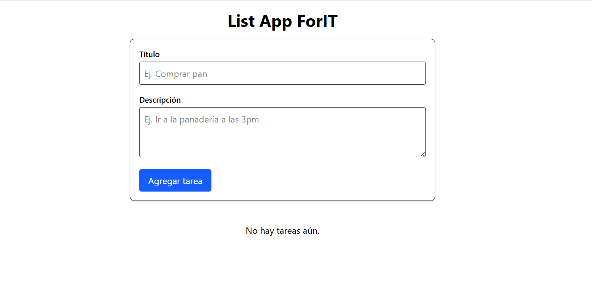
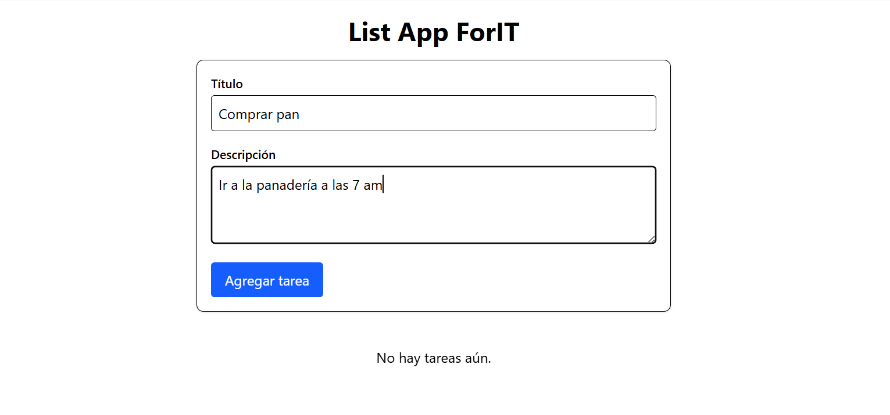
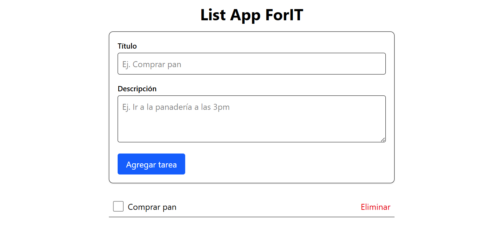
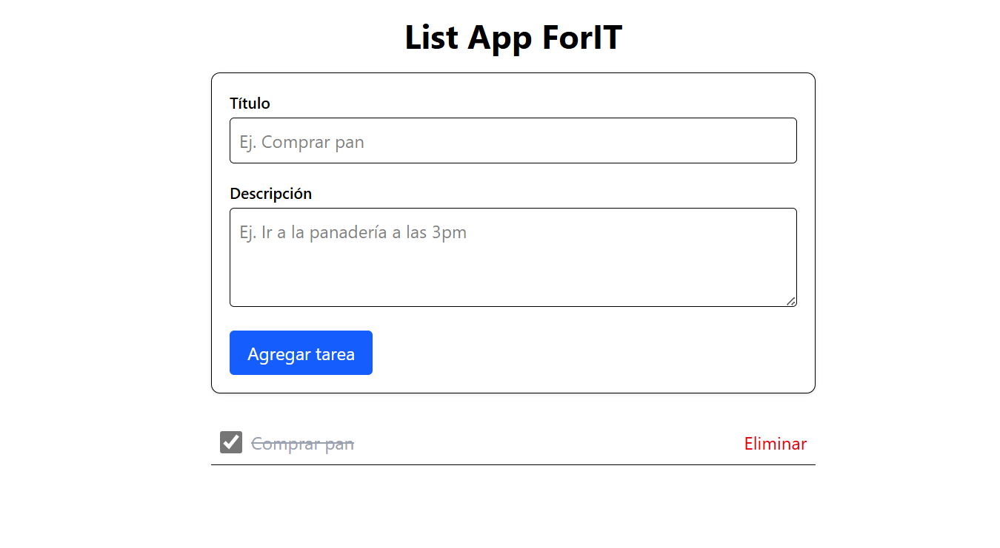

# list-app-ForIT

Aplicación full‑stack de gestión de tareas (todo‑list) desarrollada con las tecnologías más modernas:

* **Backend**: Node.js + Express + TypeScript
* **Base de datos en memoria**: Array de tareas con CRUD completo (GET, POST, PUT, DELETE)
* **Variables de entorno**: dotenv
* **Frontend**: React + Vite + TypeScript + Tailwind CSS 4.1.10
* **Gestión de datos**: Axios + React Query v5
* **Validación de formularios**: React Hook Form + Zod

---

## 📂 Estructura del repositorio

```
list-app-ForIT/
├─ backend/
│  ├─ src/
│  │  ├─ index.ts
│  │  └─ routes/
│  │     └─ tasks.ts
│  ├─ .env.example
│  ├─ .gitignore
│  ├─ package.json
│  ├─ tsconfig.json
│  └─ tsconfig.node.json
└─ frontend/
   ├─ src/
   │  ├─ api/
   │  │  ├─ axiosClient.ts
   │  │  └─ tasksApi.ts
   │  ├─ components/
   │  │  ├─ TaskForm.tsx
   │  │  ├─ TaskItem.tsx
   │  │  └─ TaskList.tsx
   │  ├─ hooks/
   │  │  └─ useTasks.ts
   │  ├─ schemas/
   │  │  └─ taskSchema.ts
   │  ├─ types.ts
   │  ├─ App.tsx
   │  ├─ index.css
   │  └─ main.tsx
   ├─ tailwind.config.cjs
   ├─ vite.config.ts
   ├─ package.json
   └─ tsconfig.app.json
```

---

## 🚀 Configuración y ejecución

### Backend

1. Entra en la carpeta `backend`:

   ```bash
   cd backend
   ```

2. Instala dependencias:

   ```bash
   npm install
   ```

3. Crea un archivo de variables de entorno `backend/.env` copiando el ejemplo:

   ```bash
   cp .env.example .env
   ```

   Ajusta `PORT` si lo deseas.

4. Arranca en modo desarrollo (auto‑reload con ts-node-dev):

   ```bash
   npm run dev
   ```

5. Para producción:

   ```bash
   npm run build
   npm start
   ```

#### Endpoints del API

| Ruta                    | Método | Descripción                                     |
| ----------------------- | ------ | ----------------------------------------------- |
| `GET /api/tasks`        | GET    | Lista todas las tareas                          |
| `POST /api/tasks`       | POST   | Crea una tarea (body: `{ title, description }`) |
| `PUT /api/tasks/:id`    | PUT    | Actualiza campos de una tarea                   |
| `DELETE /api/tasks/:id` | DELETE | Elimina una tarea                               |
| `GET /api/hello`        | GET    | Ruta de prueba                                  |

---

### Frontend

1. Entra en la carpeta `frontend`:

   ```bash
   cd frontend
   ```

2. Instala dependencias:

   ```bash
   npm install
   ```

3. Variables de entorno (opcional):

   ```bash
   # Crea un .env para cambiar la URL del API
   touch .env
   echo "VITE_API_BASE_URL=http://localhost:4000" > .env
   ```

4. Arranca el servidor de desarrollo:

   ```bash
   npm run dev
   ```

5. Abre en el navegador `http://localhost:5173/`

---

## 🎁 Bonus opcionales

* Validación avanzada con React Hook Form + Zod
* Estructura de carpetas y nomenclatura basada en convenciones de monorepo
* Tailwind CSS v4.1.10 sin PostCSS ni Autoprefixer manual
* React Query v5 para caché y sincronización automática

---

---

## 📸 Capturas de pantalla









---


## 📝 Licencia

MIT © Dante Nicolás Caballero
